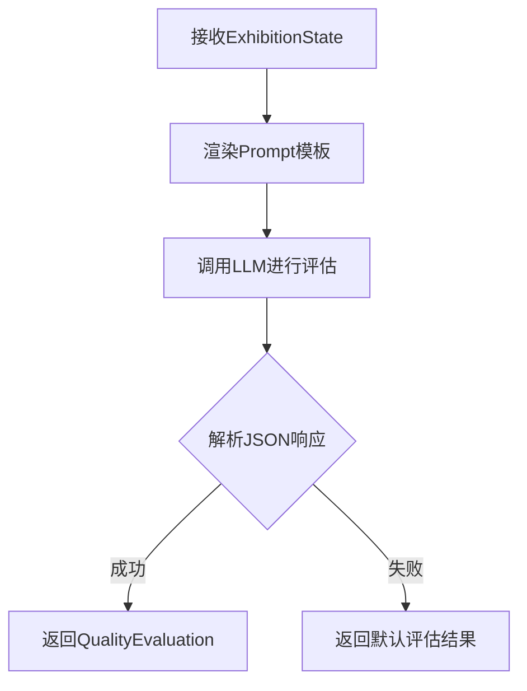

# 质量评估智能体输入输出文档

## 概述

**智能体名称**: Supervisor Agent（监督智能体）
**功能模块**: 质量评估 (`evaluateQuality`)
**文件位置**: `backend/src/agents/supervisor.ts:283-359`

---

## 一、输入参数

### 1. 方法签名
```typescript
async evaluateQuality(state: ExhibitionState): Promise<QualityEvaluation>
```

### 2. 完整输入结构

#### 2.1 基础项目信息
| 字段 | 类型 | 说明 | 示例 |
|------|------|------|------|
| `title` | string | 展览标题 | "古代文明特展" |
| `theme` | string | 展览主题 | "穿越千年的文明对话" |
| `budget` | number | 总预算 | 500000 |
| `currency` | string | 货币单位 | "CNY" |

#### 2.2 迭代信息
| 字段 | 类型 | 说明 | 示例 |
|------|------|------|------|
| `iterationCount` | number | 当前迭代次数（从0开始） | 1 |
| `maxIterations` | number | 最大迭代次数 | 3 |

#### 2.3 设计方案数据（可选）

**2.3.1 概念策划** (`state.conceptPlan`)
| 字段 | 类型 | 说明 | 示例 |
|------|------|------|------|
| `concept` | string | 核心概念 | "时空对话" |
| `narrative` | string | 叙事结构 | "从古代到现代的文明演进" |
| `keyExhibits` | string[] | 重点展品 | ["青铜器", "陶俑", "玉器"] |
| `visitorFlow` | string | 观众动线 | "入口→序厅→主展区→互动区→出口" |

**2.3.2 空间设计** (`state.spatialLayout`)
| 字段 | 类型 | 说明 | 示例 |
|------|------|------|------|
| `layout` | string | 空间布局描述 | "环形布局" |
| `visitorRoute` | string[] | 参观路线 | ["序厅", "主展区", "互动区"] |
| `zones` | Zone[] | 功能区域 | [{name: "主展区", area: 200, function: "展示文物"}] |

**2.3.3 视觉设计** (`state.visualDesign`)
| 字段 | 类型 | 说明 | 示例 |
|------|------|------|------|
| `colorScheme` | string[] | 色彩方案 | ["#8B4513", "#D4AF37"] |
| `typography` | string | 字体设计 | "宋体+黑体" |
| `brandElements` | string[] | 品牌元素 | ["Logo", "导视系统"] |
| `visualStyle` | string | 视觉风格 | "古典现代融合" |

**2.3.4 互动技术** (`state.interactiveSolution`)
| 字段 | 类型 | 说明 | 示例 |
|------|------|------|------|
| `technologies` | string[] | 使用技术 | ["AR", "触摸屏", "投影映射"] |
| `interactives` | Interactive[] | 互动装置 | [{name: "AR导览", type: "AR", description: "...", cost: 50000}] |

**2.3.5 预算估算** (`state.budgetEstimate`)
| 字段 | 类型 | 说明 | 示例 |
|------|------|------|------|
| `totalCost` | number | 总成本 | 480000 |
| `breakdown` | BreakdownItem[] | 预算明细 | [{category: "空间设计", amount: 200000, description: "..."}] |
| `recommendations` | string[] | 优化建议 | ["可考虑租赁设备降低成本"] |

#### 2.4 历史反馈（可选）
| 字段 | 类型 | 说明 | 示例 |
|------|------|------|------|
| `feedbackHistory` | string[] | 历次反馈记录 | ["第1次: 预算超支", "第2次: 互动装置过多"] |

---

## 二、输出结果

### 1. 输出类型定义
```typescript
interface QualityEvaluation {
  overallScore: number;        // 0-1: 总体质量分数
  conceptScore: number;        // 0-1: 概念策划分数
  spatialScore: number;        // 0-1: 空间设计分数
  visualScore: number;         // 0-1: 视觉设计分数
  interactiveScore: number;    // 0-1: 互动技术分数
  budgetScore: number;         // 0-1: 预算合理性分数
  feedback: string;            // 反馈意见（200-300字）
  revisionTarget: RevisionTarget; // 需要修订的节点
}
```

### 2. 输出字段详细说明

#### 2.1 分数字段（0-1范围）

| 字段 | 评估维度 | 评分标准 |
|------|----------|----------|
| **overallScore** | 总体质量 | 综合各维度得分，≥0.85优秀，≥0.75良好，≥0.6合格 |
| **conceptScore** | 概念策划 | 创意性、主题契合度、叙事逻辑、场景适配性 |
| **spatialScore** | 空间设计 | 布局合理性、动线流畅度、功能完整性、人体工程学 |
| **visualScore** | 视觉设计 | 美学价值、品牌一致性、可实施性、场景契合度 |
| **interactiveScore** | 互动技术 | 技术可行性、用户体验、创新性、场景适配性 |
| **budgetScore** | 预算合理性 | 成本控制、性价比、风险控制、分配合理性 |

#### 2.2 反馈字段

| 字段 | 类型 | 说明 | 示例 |
|------|------|------|------|
| `feedback` | string | 综合反馈意见，需包含各维度的具体评价和改进建议（200-300字） | "概念策划创意性较强，但空间设计的动线流畅度有待提升。建议优化参观路线，减少回头路。预算控制在合理范围内，但互动装置成本偏高，建议考虑租赁方式。" |

#### 2.3 修订目标字段

| 字段 | 类型 | 可能值 | 说明 |
|------|------|--------|------|
| `revisionTarget` | enum | `"none"` | 无需修订（质量≥0.85或已达到最大迭代次数） |
| | | `"curator"` | 需要重新策划（概念有问题） |
| | | `"spatial_designer"` | 需要重新设计空间（空间有问题） |
| | | `"parallel_designs"` | 需要并行设计（空间和视觉同时修改） |
| | | `"visual_designer"` | 需要重新设计视觉（视觉有问题） |
| | | `"interactive_tech"` | 需要重新设计互动技术（技术有问题） |
| | | `"budget_controller"` | 需要重新计算预算（预算有问题） |

---

## 三、评估逻辑

### 1. 评估流程



### 2. 默认评估（解析失败时）

```typescript
{
  overallScore: 0.7,
  conceptScore: state.conceptPlan ? 0.7 : 0,
  spatialScore: state.spatialLayout ? 0.7 : 0,
  visualScore: state.visualDesign ? 0.7 : 0,
  interactiveScore: state.interactiveSolution ? 0.7 : 0,
  budgetScore: state.budgetEstimate ? 0.7 : 0,
  feedback: "无法解析详细评估，使用默认分数",
  revisionTarget: "none"
}
```

### 3. 质量等级判断标准

| 分数范围 | 等级 | 需要修订 | 处理方式 |
|---------|------|---------|----------|
| 0.9-1.0 | 优秀 | ❌ | 直接通过 |
| 0.75-0.9 | 良好 | ❌ | 小问题可忽略 |
| 0.6-0.75 | 合格 | ⚠️ | 需要轻微修订 |
| <0.6 | 不合格 | ✅ | 需要大幅修订 |

---

## 四、Prompt模板

### 1. System Prompt（角色定义）

```
你是展陈设计系统的资深质量评估专家，拥有12年展陈项目质量评估与验收实战经验...

【核心能力】
1. 精通设计质量评估、用户体验评价、技术可行性分析、成本效益评估
2. 熟悉《展览陈列工程质量验收标准》《博物馆展览质量评估规范》等行业规范
3. 掌握从概念质量到落地执行的全流程质量评估方法论

【评估维度（每个维度0-1分）】
1. 概念策划（conceptScore）：创意性、主题契合度、叙事逻辑、场景适配性
2. 空间设计（spatialScore）：布局合理性、动线流畅度、功能完整性、人体工程学
3. 视觉设计（visualScore）：美学价值、品牌一致性、可实施性、场景契合度
4. 互动技术（interactiveScore）：技术可行性、用户体验、创新性、场景适配性
5. 预算合理性（budgetScore）：成本控制、性价比、风险控制、分配合理性
```

### 2. Human Prompt（评估任务）

```
请评估以下展陈设计方案：

【项目信息】
- 标题：{{title}}
- 主题：{{theme}}
- 预算：{{budget}} {{currency}}

【当前迭代】第 {{iterationCount}} 次（最多 {{maxIterations}} 次）

【设计方案】
1. 概念策划：{{concept}}
2. 空间设计：{{spatialLayoutDesc}}
3. 视觉设计：{{colorScheme}}
4. 互动技术：{{technologies}}
5. 预算估算：{{totalCost}}

【历史反馈】
{{feedbackHistory}}

请进行全面的质量评估，输出 JSON 格式的评估结果。
```

---

## 五、使用场景

### 1. 在工作流中的位置

```typescript
// backend/src/graph/exhibition-graph-with-human.ts:315
const qualityEvaluation = await this.supervisor.evaluateQuality(state);
```

**调用时机**：
- 所有5个设计阶段（策划、空间、视觉、互动、预算）都完成后
- 决定是否需要人工审核或自动修订

### 2. 决策逻辑

```typescript
// backend/src/agents/supervisor.ts:364-404
shouldRevise(evaluation: QualityEvaluation, iterationCount: number, maxIterations: number) {
  // 1. 如果质量足够高（≥0.85），不需要修订
  if (evaluation.overallScore >= 0.85) {
    return { needsRevision: false, reason: "质量优秀，无需修订" };
  }

  // 2. 如果达到最大迭代次数，不再修订
  if (iterationCount >= maxIterations) {
    return { needsRevision: false, reason: "已达到最大迭代次数，接受当前方案" };
  }

  // 3. 质量过低（<0.6），需要修订
  if (evaluation.overallScore < 0.6) {
    return { needsRevision: true, reason: `总体质量低于标准，需要${evaluation.revisionTarget}重新设计` };
  }

  // 4. 质量一般（0.6-0.75），可以修订也可以接受
  if (evaluation.overallScore < 0.75 && evaluation.revisionTarget !== "none") {
    return { needsRevision: true, reason: `质量有待提升，建议${evaluation.revisionTarget}进行优化` };
  }

  return { needsRevision: false, reason: "质量合格，继续流程" };
}
```

### 3. 人工审核触发条件

```typescript
// backend/src/graph/exhibition-graph-with-human.ts:322-360
if (qualityEvaluation.overallScore >= 0.85) {
  // 自动批准
  broadcastLog('info', `质量评估: ${score}分 (自动批准)`);
} else if (qualityEvaluation.overallScore < 0.6) {
  // 自动修订
  broadcastLog('warning', `质量评估: ${score}分 - ${feedback}`);
} else {
  // 等待人工决策
  broadcastWaitingForHuman(qualityEvaluation, iterationCount, revisionTarget);
}
```

---

## 六、配置信息

### 1. 模型配置

```typescript
// backend/src/agents/supervisor.ts:13
constructor(modelName?: string, temperature: number = 0.5)
```

**默认参数**：
- `temperature`: 0.5（较低温度保证评估的一致性）
- `modelName`: 从环境变量读取（默认使用 `MODEL_PROVIDER` 配置的模型）

### 2. 智能体专属配置（可选）

```env
# backend/.env
SUPERVISOR_PROVIDER=zhipuai
SUPERVISOR_MODEL=glm-4.7
```

---

## 七、错误处理

### 1. LLM调用失败

```typescript
try {
  const response = await this.llm.invoke(messages);
  const responseText = response.content.toString();
  // ... 解析逻辑
} catch (error) {
  console.warn("无法解析质量评估结果，使用默认值");
  return { /* 默认评估结果 */ };
}
```

### 2. JSON解析失败

```typescript
try {
  const jsonMatch = responseText.match(/\{[\s\S]*\}/);
  if (jsonMatch) {
    const evaluation = JSON.parse(jsonMatch[0]);
    return evaluation as QualityEvaluation;
  }
} catch (error) {
  console.warn("无法解析质量评估结果，使用默认值");
}
// 返回默认评估结果
```

---

## 八、示例

### 输入示例

```typescript
const state: ExhibitionState = {
  requirements: {
    title: "古代文明特展",
    theme: "穿越千年的文明对话",
    budget: { total: 500000, currency: "CNY" },
    // ...
  },
  conceptPlan: {
    concept: "时空对话",
    narrative: "从古代到现代的文明演进",
    keyExhibits: ["青铜器", "陶俑", "玉器"],
    visitorFlow: "入口→序厅→主展区→互动区→出口"
  },
  spatialLayout: {
    layout: "环形布局",
    visitorRoute: ["序厅", "主展区", "互动区"],
    zones: [
      { name: "主展区", area: 200, function: "展示文物" }
    ]
  },
  // ... 其他设计数据
  iterationCount: 1,
  maxIterations: 3,
  feedbackHistory: []
};
```

### 输出示例

```typescript
{
  "overallScore": 0.78,
  "conceptScore": 0.85,
  "spatialScore": 0.75,
  "visualScore": 0.8,
  "interactiveScore": 0.7,
  "budgetScore": 0.8,
  "feedback": "概念策划创意性较强，主题契合度高。空间布局合理，但参观路线存在一定的重复。视觉设计风格统一，但品牌元素应用不够突出。互动技术方案可行，但成本控制需要优化。预算总体合理，但互动装置成本偏高。建议优化互动装置方案，降低成本。",
  "revisionTarget": "interactive_tech"
}
```

---

## 九、相关文件

| 文件路径 | 说明 |
|---------|------|
| `backend/src/agents/supervisor.ts` | 质量评估智能体实现 |
| `backend/src/prompts/supervisor.prompts.ts` | Prompt模板定义 |
| `backend/src/types/exhibition.ts` | 类型定义 |
| `backend/src/graph/exhibition-graph-with-human.ts` | 工作流集成 |
| `backend/src/graph/exhibition-graph.ts` | 工作流集成（无人工） |
| `backend/src/graph/revision-controller.ts` | 修订控制器 |

---

## 十、版本信息

- **Prompt版本**: v1.1.0
- **创建时间**: 2025-01-02
- **最后更新**: 2025-01-05
- **作者**: Claude
- **维护者**: 项目团队

---

**文档生成时间**: 2026-01-07
**相关文档**:
- [MULTI_LLM_ARCHITECTURE.md](./MULTI_LLM_ARCHITECTURE.md)
- [AGENT_LEVEL_LLM_GUIDE.md](./AGENT_LEVEL_LLM_GUIDE.md)
